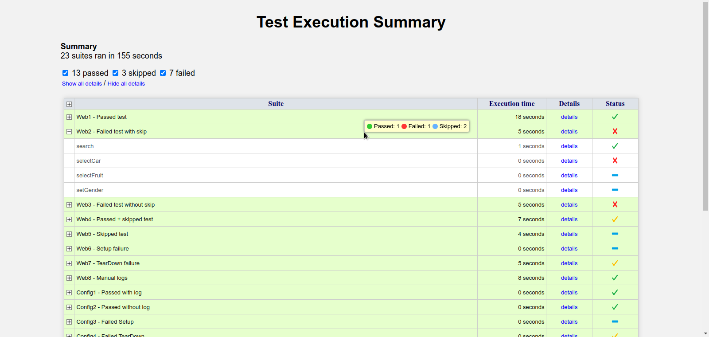
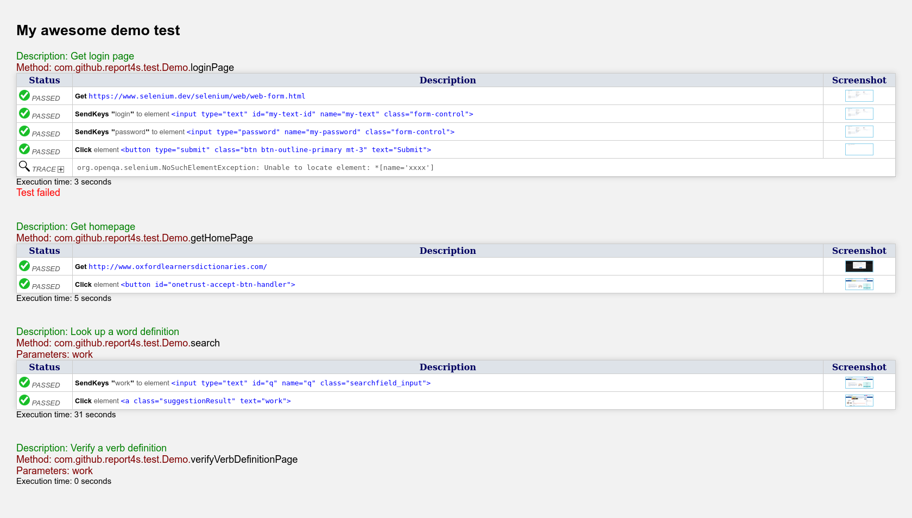
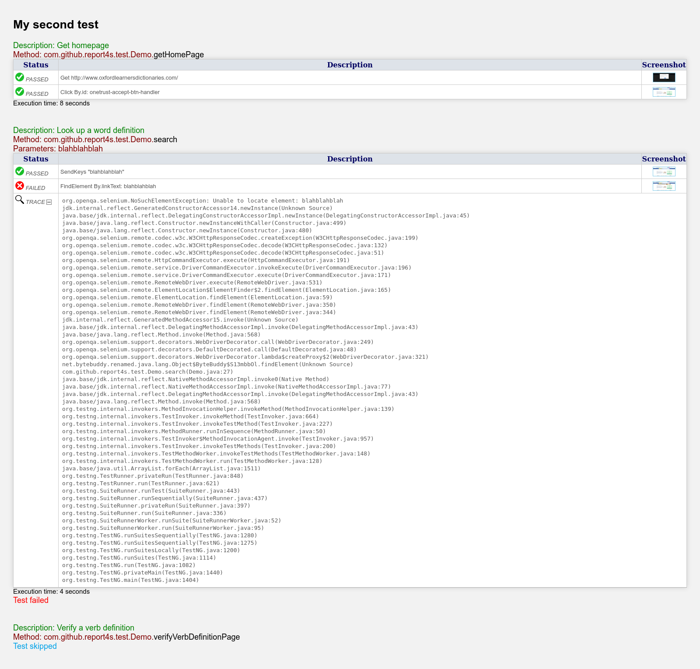

# Report4s

Simple and yet elegant Selenium HTML report.

Report4s is a Selenium HTML reporter for the TestNG framework.

It is only compatible with Selenium 4 or later.


## Features

 + Can automatically log screenshots upon the following webdriver events:
    + `Select.deselectByIndex(int)`
    + `Select.deselectByValue(java.lang.String)`
    + `Select.deselectByVisibleText(java.lang.String)`
    + `Select.selectByIndex(int)`
    + `Select.selectByValue(java.lang.String)`
    + `Select.selectByVisibleText(java.lang.String)`
    + `WebDriver.get(java.lang.String)`
    + `WebDriver.navigate().back()`
    + `WebDriver.navigate().forward()`
    + `WebDriver.navigate().refresh()`
    + `WebDriver.navigate().to(java.lang.String)`
    + `WebDriver.navigate().to(java.net.URL)`
    + `WebElement.click()`
    + `WebElement.sendKeys(CharSequence[])`

 + The stack trace of exceptions are also logged in order to facilitate error analysis.

 + Different screenshot gathering modes are supported:
    + `all`     All screenshots for intercepted webdriver events.
    + `last`    The screenshot of the last step for each `@Test` annotated method.
    + `failed`  The last screenshot of each test failure.
    + `none`    Deactivation of automatic screenshot gathering.


## The ZIP file contents

```
report4.zip
|---javadoc                    The API documentation
|---report4s.properties        Configuration file (optional)
|---lib                        Required external libraries
    |---report4s.jar
    |---commons-io-2.12.0.jar
    |---commons-lang3-3.12.0.jar
```


## Requirements
Java 8 or later

testng 7.8.0 or later

Selenium 4.10.0 or later


## Caution
Do not rename the report4s JAR file.


## Installation
Add the JAR files to the classpath.

Add `report4s.properties` file in your project root folder (optional).


## TestNG XML file configuration
Add the following lines before the closing `</suite>` tag in your testng XML file :

```
<!DOCTYPE suite SYSTEM "http://testng.org/testng-1.0.dtd" >
<suite name="..." >
    ...
    ...
    <listeners>
        <listener class-name="net.sourceforge.report4s.ReportIndex" />
        <listener class-name="net.sourceforge.report4s.TestListener" />
        <listener class-name="net.sourceforge.report4s.SuiteListener" />
        <listener class-name="net.sourceforge.report4s.ConfigurationListener" />
    </listeners>
</suite> 
```


## The packages to import

```
import com.github.report4s.*;
```

or

```
import com.github.report4s.DriverListener;
import com.github.report4s.Report4s;
import com.github.report4s.Level;
```


## The test configuration

The WebDriver needs to be decorated with a WebDriver listener.

```
import com.github.report4s.DriverListener;

public class MyTest {
 
    private WebDriver driver;
    
    @BeforeSuite(alwaysRun=true)
    public void setUp() {
        WebDriver raw_driver;
        
        // Initialize raw_driver as instance of FirefoxDriver, or ChromeDriver, or EdgeDriver, etc.
        
        DriverListener listener = new DriverListener();
        this.driver = new EventFiringDecorator<WebDriver>(listener).decorate(raw_driver);
        this.driver.manage().window().maximize();
    }

    // Your @Test annotated methods go here.
    
    @AfterSuite
    public void tearDown() {
        try { this.driver.quit(); }
        catch (Exception e) { }
    }   
}
```


## How to log


The log levels are :
`PASSED`, `FAILED`, `INFO`, `WARNING` `ERROR` and `DEBUG`

* To log a web browser event :

  `Report4s.logEvent(String description, boolean screenshot);`

* To log a custom message :

  `Report4s.logMessage(Level.*, String description);`

* To log a custom message with a full page screenshot :

  `Report4s.logMessage(Level.*, description, webdriver);`

* To log custom message with a WebElement screenshot :

  `Report4s.logMessage(Level.*, description, webdriver, webelement);`

* For WebElement screenshots you have the possibility to apply an extra padding :

  `Report4s.logMessage(Level.*, description, webdriver, webelement, padding);`

Replace `*` by `PASSED`, `FAILED`, `INFO`, `WARNING` `ERROR` and `DEBUG`


## Sample Java code

The Report4s is able to log screenshots automatically upon webdriver events.

If the screenshots gathering is deactivated, screenshots can still
be taken by making explicit calls to `Report4s.LogMessage` methods.

```
@Test(description = "My test description")
public void test1() {

    this.driver.get("http://www.example.com");
    Report4s.logMessage(Level.PASSED, "Manual log with screenshot", this.driver);

    WebElement elem;
    elem = this.driver.findElement(By.name("xxxx"));
    elem.sendKeys("Hello World !!");

    elem = this.driver.findElement(By.id("xxxx"));
    elem.click();

    Select sel = new Select(this.driver.findElement(By.name("xxxx")));
    sel.selectByValue("xxxx");
    Report4s.logMessage(Level.INFO, "Manual log without screenshot");

    this.driver.navigate().back();
}
```

You are encouraged to use the `description` attribute of the `@Test` annotation to verbose your reports.

A good tutorial on how to use testng with Selenium can be found here: http://testng.org/doc/selenium.html

The example is for Selenium v1 but the same principles also apply to Selenium v4.


## Limitations

Several `FAILED` screenshots are logged when using Waiting strategies (implicit, explicit or fluent wait)

No support for HtmlUnitDriver webdriver.

No support for multi-threaded tests.


## Good Practices

Use the description attribute of the `@Test` annotation to verbose your reports.

` @Test(description = "Sign in")`

To avoid several FAILED logs when using Waiting strategies,
deactivate the automatic screenshot gathering before the wait,
then reactivate it after the wait.

```
    // Deactivate automatic screenshots
    Report4s.screenshots = "none";

    WebDriverWait wait = new WebDriverWait(this.driver, Duration.ofSeconds(10));
    wait.until(ExpectedConditions.presenceOfElementLocated(By.id("my-id")));
    this.driver.findElement(By.id("my-id")).click();

    // Manual log if you don't want to miss the screenshot of the last event right after the wait.
    Report4s.logMessage(Level.PASSED, "Click on element id = 'my-id'", this.driver);

    // Reactivate automatic screenshots
    Report4s.screenshots = "all";    // or "last" or "failed".
```

One annoying thing of unit test frameworks, is that tests are executed in random order.
Set the order of execution of methods directly in the testng XML files.

```
<suite name="My test suite">
    <test name="My Test" preserve-order="true">
        <classes>
            <class name="mypackage.MyTest"/>
                <methods>
                    <include name="method1"/>
                    <include name="method2"/>
                    <include name="method3"/>
                </methods>
            </class>
        </classes>
    </test>
</suite>
```


## report4s.properties file

```
#IF YOU WANT TO MODIFY A PROPERTY DEFAULT VALUE,
#UNCOMMENT THE APPROPRIATE LINE AND SET THE VALUE OF YOUR CHOICE.


#The report directory relative to the workspace (working directory).
#It is advisable to avoid using the same TestNG default report directory (test-output).
#report4s.report.dir=report


#The file name of the report homepage.
#report4s.report.homepage=index.html


#The title of the report home page.
#report4s.report.title=Test Execution Summary


#The screenshots to gather.
#Values: all, last, failed or none.
#report4s.screenshots.enabled=all


#Whether to take screenshots of WebElements or pages.
#Values: page or element.
#report4s.screenshots.target=page


#Padding in pixels to be applied to WebElement screenshots.
#Defines the area around the WebElement to be included in the screenshot.
#report4s.screenshots.padding=10


#The number of decimals of precision to be displayed in execution time labels.
#The value should be an integer between 0 and 3.
#report4s.time.precision=0


#Whether to display tooltips with the execution result for each individual suite.
#report4s.suite.tooltips.enabled=true


#Whether to skip the remaining tests of the current suite if a test fails.
#report4s.execution.skipSuiteAfterTestFailure=true
```


## Sample screenshots

##### Sample 1 :


##### Sample 2 :


##### Sample 3 :

